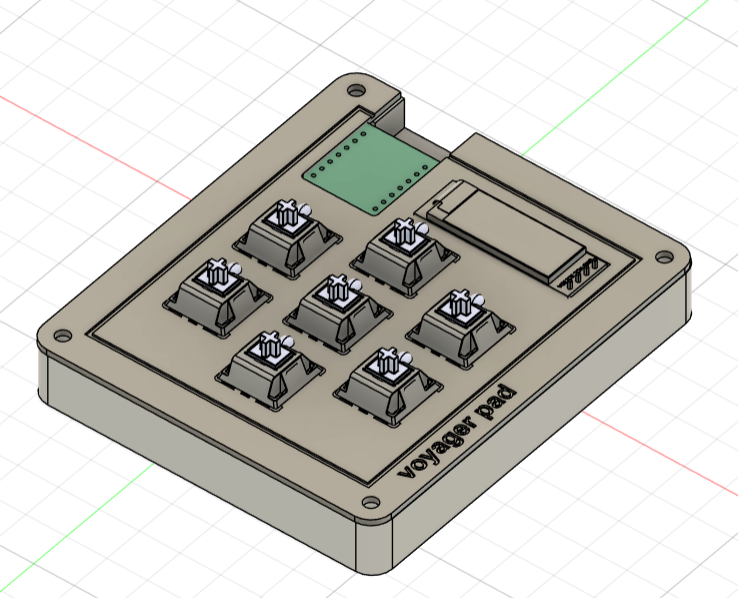
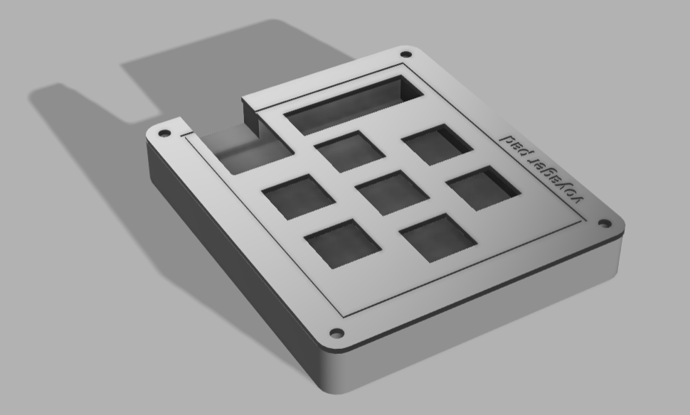

# Voyagerpad

Voyagerpad is a 7 key macropad with an OLED Display.

## Features:
- 128x32 OLED Display
- 7 Keys

## PCB
The PCB was made in KiCad.

### Schematic

### PCB 

  
  
  

Silkscreen image credit: [Martin Melin – Voyager (via macpaint.org)](http://www.macpaint.org/images/1980s/martin_melin_voyager.gif)
## CAD Model:
The case was made in Autodesk Fusion.

### BOM

Here is everything needed to make this macropad:
- 1x XIAO RP2040
- 1x 0.91" 128x32 OLED Display
- 7x Cherry MX Switches
- 7x DSA Keycaps
- 1x Case
